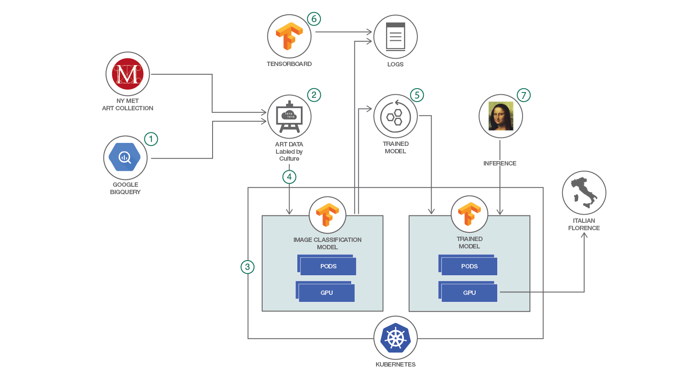

# Train a TensorFlow model on Kubernetes to recognize art culture based on the collection from the Metropolitan Museum of Art

In this Code Pattern, we will use Deep Learning to train an image classification model.
The data comes from the art collection at the New York Metropolitan Museum of Art and the metadata from Google BigQuery.
We will use the Inception model implemented in TensorFlow and we will run the training on a Kubernetes cluster.
We will save the trained model and load it later to perform inference.
To use the model, we provide as input a picture of a painting and the model will return the likely culture, for instance "Italian, Florence" art.
The user can choose other attributes to classify the art collection, for instance author, time period, etc.
Depending on the compute resources available, the user can choose the number of images to train, the number of classes to use, etc.
In this Code Pattern, we will select a small set of images and a small number of classes to allow the training to complete within a reasonable amount of time.
With a large dataset, the training may take days or weeks.

When the reader has completed this Code Pattern, they will understand how to:

* Collect and process the data for Deep Learning in TensorFlow
* Configure Distributed TensorFlow to run on a cluster of servers
* Configure and deploy TensorFlow to run on a Kubernetes cluster
* Train an advanced image classification Neural Network
* Use TensorBoard to visualize and understand the training process




## Flow

1. Inspect the available attributes in the Google BigQuery database for the Met art collection
2. Create the labeled dataset using the attribute selected
3. Select a model for image classification from the set of available public models and deploy to IBM Cloud
4. Run the training on Kubernetes, optionally using GPU if available
5. Save the trained model and logs
6. Visualize the training with TensorBoard
7. Load the trained model in Kubernetes and run an inference on a new art drawing to see the classification


## Included components

* [TensorFlow](http://www.tensorflow.org): An open-source library for implementing Deep Learning models
* [Image classification models](https://github.com/tensorflow/models/tree/master/slim): An implementation of the Inception neural network for image classification
* [Google metadata for Met Art collection](https://bigquery.cloud.google.com/dataset/bigquery-public-data:the_met?pli=1): A database containing metadata for the art collection at the New York Metropolitan Museum of Art
* [Met Art collection](link): A collection of over 200,000 public art artifacts, including paintings, books, etc.
* [Kubernetes cluster](https://kubernetes.io): An open-source system for orchestrating containers on a cluster of servers
* [IBM Cloud Container Service](https://console.ng.bluemix.net/docs/containers/container_index.html?cm_sp=dw-bluemix-_-code-_-devcenter): A public service from IBM that hosts users applications on Docker and Kubernetes


## Featured technologies

* [TensorFlow](https://www.tensorflow.org): Deep Learning library
* [TensorFlow models](https://github.com/tensorflow/models/tree/master/research/slim): Public models for Deep Learning
* [Kubernetes](https://kubernetes.io): Container orchestration


# Watch the Video
[](https://www.youtube.com/watch?v=I-8xmMxo-RQ)


# Prerequisites

Install [TensorFlow](https://www.tensorflow.org/install) on your workstation.

Create a Kubernetes cluster by one of the following methods:
* [Minikube](https://kubernetes.io/docs/getting-started-guides/minikube) for local testing using your own servers.
* [IBM Cloud Container Service](https://github.com/IBM/container-journey-template) to deploy in cloud.
* [IBM Cloud Private](https://www.ibm.com/cloud-computing/products/ibm-cloud-private/) for either scenario above.

The code here is tested against [Kubernetes Cluster from IBM Cloud Container Service](https://console.ng.bluemix.net/docs/containers/cs_ov.html#cs_ov).


# Steps
1. [Register for Google BigQuery and set up your environment](#1-set-up-environment)
2. [Create the label for the dataset](#2-create-label)
3. [Download the data](#3-download-data)
4. [Convert the data to TFRecord format](#4-convert-data)
5. [Create TensorFlow container image](#5-create-image)
6. [Deploy the TensorFlow pods to run the training on Kubernetes](#6-deploy-training)
7. [Evaluate the accuracy of the trained model](#7-evaluate-model)
8. [Save the trained model and logs](#8-save-trained-model)
9. [Visualize the training with TensorBoard](#9-visualize)
10. [Load the trained model in Kubernetes and run an inference on a new art drawing](#10-run-inference)


### 1. Set up environment

Refer to the [instructions](https://cloud.google.com/bigquery/docs/reference/libraries) to install the client on your
laptop to interact with Google BigQuery:

```
$ pip install --upgrade google-cloud-bigquery
```

Install the [Google Cloud SDK](https://cloud.google.com/sdk/docs/) on your laptop.

> For example, on the Mac, download and unzip ` google-cloud-sdk-168.0.0-darwin-x86_64.tar.gz`.

Run the command:

```
$ ./google-cloud-sdk/bin/gcloud init
```

This will start the browser and request you to log into your gmail account and ask you to choose a project
in Google cloud.  Note the project id in this step so you can use it in the query script later.

Authenticate for the client on your laptop by this command:

```
$ ./google-cloud-sdk/bin/gcloud auth application-default login
```

Your laptop should be ready to interface with Google BigQuery.


### 2. Create label

A labeled dataset is the first requirement for training a model.  Collecting the data and associating label to the data typically
requires a lot of resources and effort.

Google BigQuery contains a collection of public databases that are useful for various purposes.  For our case, we are interested
in the data for the [art collection at the Metropolitan Museum](https://bigquery.cloud.google.com/table/bigquery-public-data:the_met.objects?pli=1)
Check this [blog](https://cloud.google.com/blog/big-data/2017/08/when-art-meets-big-data-analyzing-200000-items-from-the-met-collection-in-bigquery)
for more details.  Looking at the tables, we see quite a few attributes that can be used to label the art data.
For this Code Pattern, we will select the "culture" attribute, which describes the name of the culture where the art item
is originated from, for instance "Italian, Florence".  Based on the example from this Code Pattern, you can choose any other
attribute to label the art images.

The file bigquery.py provides a simple python script that will query the Google BigQuery database.
To get a list of the unique cultures, the SQL string is:

```sql
SELECT culture, COUNT(*) c
        FROM `bigquery-public-data.the_met.objects`
        GROUP BY 1
        ORDER BY c DESC
```

To get a list of all art items labeled with the culture, the SQL string is:

```sql
SELECT department, culture, link_resource
        FROM `bigquery-public-data.the_met.objects`
        WHERE culture IS NOT NULL
        LIMIT 200
```

You can enter these strings on the Google BigQuery console to see the data. The Code Pattern also provides convenient script
to query the attributes. First clone this git repository:

```
$ cd ~
$ git clone https://github.com/IBM/tensorflow-kubernetes-art-classification.git
```

The script to query Google BigQuery is bigquery.py. Edit the script to put in the appropriate SQL string
above.  Update the project with the id from the previous step.

```
client = bigquery.Client(project="change-to-your-project-id")
```

Run the script:

```
$ cd tensorflow-kubernetes-art-classification
$ python bigquery.py
```

You can redirect the output to save to a file.  For reference, the output of the two queries above are provided in the
following files:

* cultures-all.list
* arts-all.list


### 3. Download data

Although the Google BigQuery holds the attributes, the photos of the art collection are actually kept at a site
from the Metropolitan Museum of Art.  Therefore, to build our labeled dataset, we will need to download the photos
and associate them with the labels.  Looking at the list of art items, there are some 114,627 items with labels
that we can use.  There are 4,259 unique labels for these items, although only 540 labels have more than 10 photos and
would be useful for training a model.  If a particular culture has just a few art images, it's probably not enough
to train the model.

The script download.py is provided to build the raw labeled data.  It will read from the file arts-select.list,
download the image source found in each line and place it in a directory named with the label.
You can copy from the lines in the file `arts-all.list` into the file `arts-select.list` and edit as needed
to create a list of images to download.

```
$ python download.py
```

> Note: If disk space is a concern to you, or you would like to use IBM Bluemix Kubernetes Service(Lite),
you can just unzip sample-dataset.tar.gz and use that as your downloaded data.


### 4. Convert data

At this point, we will begin to use TensorFlow code to process the data.
Install TensorFlow on your environment following the [instructions from TensorFlow](https://www.tensorflow.org/install/).

Clone the TensorFlow git repository containing a collection of public models:

```
$ cd ~
$ git clone https://github.com/tensorflow/models.git
```

We will use and extend the collection of image classification models in the directory `models/slim`.
The code provided in this directory will allow you to process several different image datasets
(CIFAR, Flowers, ImageNet) and you can choose from several advanced models to train.
To extend this code base to process our new dataset of art images, copy the following files into the
directory:

```
$ cp tensorflow-kubernetes-art-classification/dataset_factory.py models/research/slim/datasets/dataset_factory.py
$ cp tensorflow-kubernetes-art-classification/arts.py models/research/slim/datasets/arts.py
```

We will convert the raw images into the TFRecord format that the TensorFlow code will use.
To convert the art dataset, put the directories of downloaded pictures in a directory named `met_art`,
for instance `~/data/met_art`.
Run the script:

```
$ cp tensorflow-kubernetes-art-classification/convert.py models/research/slim/convert.py
$ cd models/research/slim
$ python convert.py --dataset_dir="~/data"
```

The output will be in the directory `~/data`:

```
arts_train_00000-of-00005.tfrecord
arts_train_00001-of-00005.tfrecord
arts_train_00002-of-00005.tfrecord
arts_train_00003-of-00005.tfrecord
arts_train_00004-of-00005.tfrecord
arts_validation_00000-of-00005.tfrecord
arts_validation_00001-of-00005.tfrecord
arts_validation_00002-of-00005.tfrecord
arts_validation_00003-of-00005.tfrecord
arts_validation_00004-of-00005.tfrecord
labels.txt
```

Note that the data has been divided into two sets:  one for training and one for validation.  The portion
of data set aside for validation is 25% and this can be changed in the script convert.py.  The file
`labels.txt` lists all the culture labels found in the images directory.

Occasionally, an image file is corrupted and the image processing step in the conversion would fail.
You can scan the image collection first for corrupted files by running the command:

```sh
$ python convert.py --dataset_dir="~/data" --check_image=True
```

Then the corrupted images can be removed from the dataset.


### 5. Create image

To deploy the pod, you will need to create an image containing the TensorFlow code by running the command:

```
$ cd ~/tensorflow-kubernetes-art-classification
$ mkdir data
$ cp ~/data/*.tfrecord data/.
$ cp ~/data/labels.txt data/.
$ docker build -t my_image_name:v1 -f Dockerfile .
```

Note that we include a small sample copy of the dataset in this image.  The reason is twofold. First, shared
filesystem is not available for the free Bluemix account.  In normal practice, the dataset is too large to copy
into the image and you would keep the dataset in a shared filesystem such as SoftLayer NFS. When a pod is started,
the shared filesystem would be mounted so that the dataset is available to all the pods. Second, the computation
resource provided with the free Bluemix account is not sufficient to run the training within a reasonable amount of
time. In practice, you would use a larger dataset and allocate sufficient resources such as multiple CPU cores and
GPU. Depending on the amount of computation resources, the training can run for days or over a week.

Next follow these [instructions](https://console.bluemix.net/docs/containers/cs_cluster.html#bx_registry_other) to:
  1. Create a namespace in Bluemix Container Registry and upload the image to this namespace
	2. Create a non-expiring registry token
	3. Create a Kubernetes secret to store the Bluemix token information


### 6. Deploy training

Update `train-model.yaml` file with your image name and secret name:

```yaml
apiVersion: v1
kind: Pod
metadata:
  name: met-art
spec:
  containers:
  - name: tensorflow
    image: registry.ng.bluemix.net/tf_ns/met-art:v1
    volumeMounts:
    - name: model-logs
      mountPath: /logs
    ports:
    - containerPort: 5000
    command:
    - "/usr/bin/python"
    - "/model/train_image_classifier.py"
    args:
    - "--train_dir=/logs"
    - "--dataset_name=arts"
    - "--dataset_split_name=train"
    - "--dataset_dir=/data"
    - "--model_name=inception_v3"
    - "--clone_on_cpu=True"
    - "--max_number_of_steps=100"
  volumes:
  - name: model-logs
    persistentVolumeClaim:
      claimName: met-art-logs
	imagePullSecrets:
	- name: bluemix-secret
  restartPolicy: Never
```

```sh
# For Mac OS
$ sed -i '.original' 's/registry.ng.bluemix.net\/tf_ns\/met-art:v1/registry.<region>.bluemix.net\/<my_namespace>\/<my_image>:<tag>/' train-model.yaml
$ sed -i '.original' 's/bluemix-secret/<my_token>/' train-model.yaml

# For all other Linux platforms
$ sed -i 's/registry.ng.bluemix.net\/tf_ns\/met-art:v1/registry.<region>.bluemix.net\/<my_namespace>\/<my_image>:<tag>/' train-model.yaml
$ sed -i 's/bluemix-secret/<my_token>/' train-model.yaml
```

Deploy the pod with the following command:

```
$ kubectl create -f train-model.yaml
```

Check the training status with the following command:

```
$ kubectl logs train-met-art-model
```

Along with the pod, a local volume will be created and mounted to the pod to hold the output of the training.
This includes the checkpoints, which are used for resuming after a crash and saving a trained model, and the
event file, which is used for visualization. Further, the restart policy for the pod is set to "Never", because
once the training is complete there is no need to restart the pod again.


### 7. Evaluate model

Evaluate the model from the last checkpoint in the training step above:

```yaml
apiVersion: v1
kind: Pod
metadata:
  name: eval-met-art-model
spec:
  containers:
  - name: tensorflow
    image: registry.ng.bluemix.net/tf_ns/met-art:v1
    volumeMounts:
    - name: model-logs
      mountPath: /logs
    ports:
    - containerPort: 5000
    command:
    - "/usr/bin/python"
    - "/model/eval_image_classifier.py"
    args:
    - "--alsologtostderr"
    - "--checkpoint_path=/logs/model.ckpt-100"
    - "--eval_dir=/logs"
    - "--dataset_dir=/data"
    - "--dataset_name=arts"
    - "--dataset_split_name=validation"
    - "--model_name=inception_v3"
    - "--clone_on_cpu=True"
    - "--batch_size=10"
  volumes:
  - name: model-logs
    persistentVolumeClaim:
      claimName: met-art-logs
  imagePullSecrets:
  - name: bluemix-secret
  restartPolicy: Never
```
Update `eval-model.yaml` file with your image name and secret name just like in step 6.

Deploy the pod with the following command:

```
$ kubectl create -f eval-model.yaml
```

Check the evaluation status with the following command:

```
$ kubectl logs eval-met-art-model
```


### 8. Save trained model

Copy all the log files on the Kubernetes persistent volume to your local host.

```
$ kubectl create -f access-model-logs.yaml
$ kubectl cp access-model-logs:/logs <path_to_local_dir>
```

If disk space is a concern, then only copy the trained model which is the last checkpoint files.
In addition, copy the event files for the next visualize step.


### 9. Visualize

The event file copied from the Kubernetes persistent volume contains the log data for TensorBoard.
Start the TensorBoard and point to the local directory with the event file:

```
$ tensorboard --logdir=<path_to_dir>
```

Then open your browser with the link displayed from the command.


### 10. Run inference

Now that you have trained a model to classify art images by culture, you can provide
a new art image to see how it will be classified by the model.

```yaml
apiVersion: v1
kind: Pod
metadata:
  name: infer-met-art-model
spec:
  containers:
  - name: tensorflow
    image: registry.ng.bluemix.net/tf_ns/met-art:v1
    volumeMounts:
    - name: model-logs
      mountPath: /logs
    ports:
    - containerPort: 5000
    command:
    - "/usr/bin/python"
    - "/model/model/classify.py"
    args:
    - "--alsologtostderr"
    - "--checkpoint_path=/logs/model.ckpt-100"
    - "--eval_dir=/logs"
    - "--dataset_dir=/data"
    - "--dataset_name=arts"
    - "--dataset_split_name=validation"
    - "--model_name=inception_v3"
    - "--image_url=https://images.metmuseum.org/CRDImages/dp/original/DP800938.jpg"
  volumes:
  - name: model-logs
    persistentVolumeClaim:
      claimName: met-art-logs
  imagePullSecrets:
  - name: bluemix-secret
  restartPolicy: Never
```

Update `infer-model.yaml` file with your docker image name and secret name just like in step 6.
In addition, replace the image_url with your choice of art image.

Deploy the pod with the following command:

```
$ kubectl create -f infer-model.yaml
```

Check the inference status with the following command:

```
$ kubectl logs infer-met-art-model
```

In the training we have run above, we used a very small dataset for illustration purposes because
of the very limited resources provided with the Lite version of the Kubernetes cluster. Therefore
the trained model only covers 5 culture categories and will not be very accurate. For this step,
you can use our [checkpoint](https://ibm.box.com/s/wyzl1k2tz1nosrf44mj20cmlruy7gsut) from a previous training that covers
600 culture categories. The accuracy at this checkpoint is 66%.
If you would like to use our checkpoint to run inference please download it from the above link
and then copy it to the Kubernetes persistent volume:

```sh
$ kubectl delete -f access-model-logs.yaml # in case the access pod already exists
$ kubectl create -f access-model-logs.yaml
$ kubectl cp inception-v3-2k-metart-images.tar.gz access-model-logs:/logs/.
$ kubectl exec access-model-logs -ti /bin/bash
$ cd /logs
$ tar xvfz inception-v3-2k-metart-images.tar.gz
$ exit
```

Next update infer-model.yaml with this checkpoint:

```yaml
command:
- "/usr/bin/python"
- "/model/model/classify.py"
args:
- "--alsologtostderr"
- "--checkpoint_path=/logs/inception-v3-2k-metart-images/model.ckpt-15000"
- "--eval_dir=/logs"
- "--dataset_dir=/logs/inception-v3-2k-metart-images"
- "--dataset_name=arts"
- "--dataset_split_name=validation"
- "--model_name=inception_v3"
- "--image_url=https://images.metmuseum.org/CRDImages/dp/original/DP800938.jpg"
```

Finally run inference:

```sh
$ kubectl delete -f infer-model.yaml # in case the infer pod already exists
$ kubectl create -f infer-model.yaml
$ kubectl logs infer-met-art-model
```
# Learn more

* **Artificial Intelligence Code Patterns**: Enjoyed this Code Pattern? Check out our other [AI Code Patterns](https://developer.ibm.com/code/technologies/artificial-intelligence/).
* **AI and Data Code Pattern Playlist**: Bookmark our [playlist](https://www.youtube.com/playlist?list=PLzUbsvIyrNfknNewObx5N7uGZ5FKH0Fde) with all of our Code Pattern videos
* **PowerAI**: Get started or get scaling, faster, with a software distribution for machine learning running on the Enterprise Platform for AI: [IBM Power Systems](https://www.ibm.com/ms-en/marketplace/deep-learning-platform)
* **Kubernetes on IBM Cloud**: Deliver your apps with the combined the power of [Kubernetes and Docker on IBM Cloud](https://www.ibm.com/cloud-computing/bluemix/containers)

# License
[Apache 2.0](LICENSE)